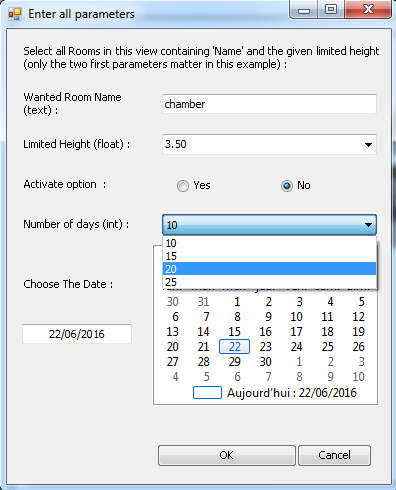

# Class Forms for User Inputs

### Introduction
This file provides an example (not a model) of class to automate the creation of basic windows/forms. You can use it quite like a TaskDialog, plus you can ask user inputs.
It builds the form depending on the given parameters, and contains some features to check and convert them in the right format.
So you only have to define these parameters and display the box. The function will be called by the window itself, no need to catch the answer after.

About dates, it returns the DateTime type, you will have to custom the format in your own functions, or adapt the class...

### Setup 
You have to paste the file userform.py in a folder known by RevitPythonShell 
- C:\Users\USERNAME\AppData\Roaming\RevitPythonShell2016  (in example)

And then import the class in your modules, as shown in the example you have two ways to declare an instance. 

###Small preview
In your code :
```python
# import class winforms
from userform import InputFormParameters

listheight = ['2.80','2.90','3.10','3.50']
listdays = ['10','15','20','25']

# creation of input box
dialog = InputFormParameters(
    selectRoomByNameHeight,                 # ref function
    
    ['Wanted Room Name', 'text'],            # type text
    
    ['Limited Height', 'float', listheight],  # type decimal with a combobox
    
    ['Activate option ', 'bool'],            # type boolean
    
    ['Number of days', 'int', listdays, False], # type integer with a combobox (read only)
    
    ['Choose The Date', 'date']             # type date
    )

# display the form
dialog.showBox()
```
In Revit :



### Todo
- create more types, and more ways with different controls
- style, anchors, icons...

To be continued...

