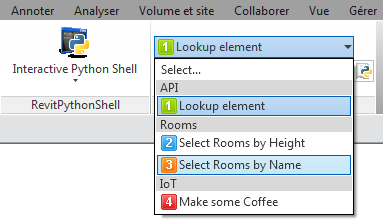
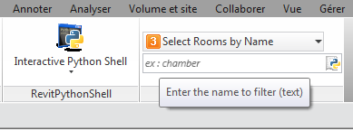

(NOTE : This approach can help but i recommend this way to automate user inputs, a bit less nested :
https://github.com/PMoureu/samples-Python-RPS/tree/master/Example-Class-Forms)

#ComboBox with TextBox Input 

This example shows how you can use stacked items to gather some 'user input' functions.

It's hard to make a pretty taskdialog input for each script, but you can build one native textbox input for all and let users enter their options :

 

This __startup.py__ script creates a textbox input linked to a combobox.

The base comes from this example :
https://github.com/daren-thomas/rps-sample-scripts/blob/master/StartupScripts/new_ribbon_panel.py

With this new code, you can "easily" plug your own commands involving user input inside this ribbon item.

It uses a single -highly nested- list (__list_options__) to :
- populate the combobox, 
- update the textbox when selection changes, 
- and parse the answers before calling the right function.

The parser allows to enter these 4 types : 
- text, integer, float, boolean (friendly no case-sensitive, yes/ no, true/false)

The separator is ',' with no limit for parameters.

It checks the needed types with __ComboMember.signature__ (you have to define that)
and also compares the number of parameters with the real signature (selected function).

### To setup this example :

- Use the startup.py and the custom init.py in order to import lookup (or delete import and 1st ComboMember)
- Create a folder 'IconsPanel' with all icons in %APPDATA%\RevitPythonShell2016 
- Set a global variable in RPS configuration with your path
    - Name : RevitPythonSpell
    - Value : "C:\USERNAME\AppData\Roaming\RevitPythonShell2016\IconsPanel" (default directory)

### To adapt this example :
1. Gather all your input-type functions (declared here or imported from a reachable module)
2. (Modify panel config if you choosed another global variable name, icons...)
3. Modify list_options to target your own functions :
    - Add/remove ComboMember lines as you want (be careful with comas)
    - Replace titles and functions names : check twice the list of 'parameters types'
    - Update the tooltips and placeholders(tip or example)
    - Launch Revit !

####TODO

The parser is still basic, it needs more locks (user input > error input !)
and flexible features (strip some spaces, custom separator)

We could also store the config in an external txt file

To be continued...
Feel free to contribute or suggest any enhancement
