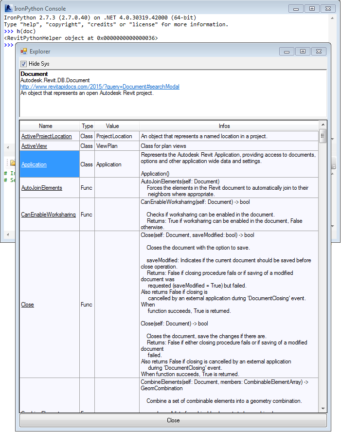

# RevitPythonHelper

## Description

This module can help you to explore the Revit API by providing details of any Revit Class or Python object you're working on
(or other .Net assemblies).

Work is in progress to analyse any object called in a script with more accuracy.


This is not a clone of RevitLookup, the first goal is to provide doc, not datas,
some values are still displayed for simple builtins types (todo : read nested arrays, maps...)


## Usage
Copy the file rph.py in a folder registered as PATH (or default RPS installation %appdata%\RevitPythonShell201* )

In the RPS console, call the form with an object to flesh out its members and try to extract any available doc  :

```python
from rph import h
h(doc)

h(rph)
```

Tips: 
- Double-click on a member to open a new tab.
- Add ```from rph import h``` in the RevitPythonShell ```__init__.py``` file to call the form more easily.
- Sort columns by clicking on headers
- Don't forget the '_' in the console (ref of the last return):
     ```python
    >>>doc.Application
    <Autodesk.Revit.ApplicationServices.Application object at 0x0000000000000033 >
    >>>h(_) 
    ```
